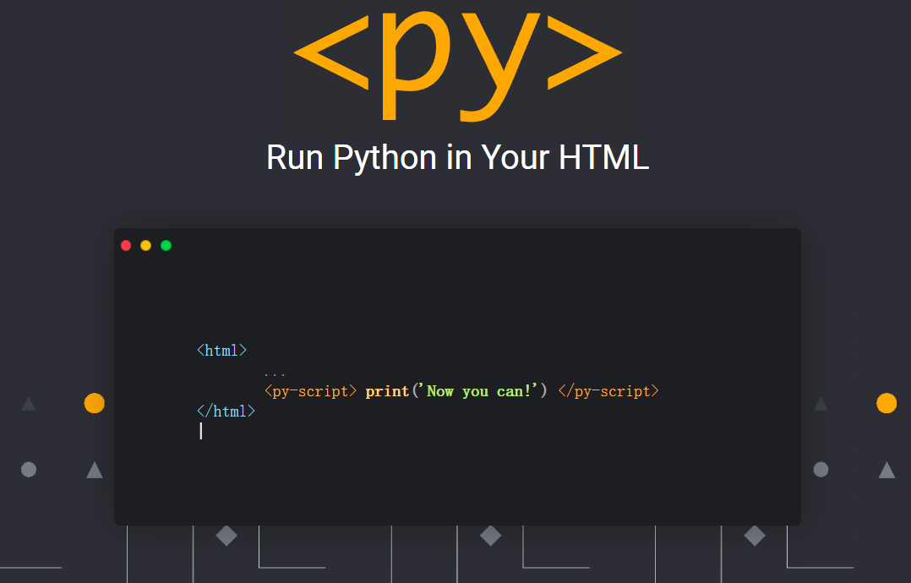
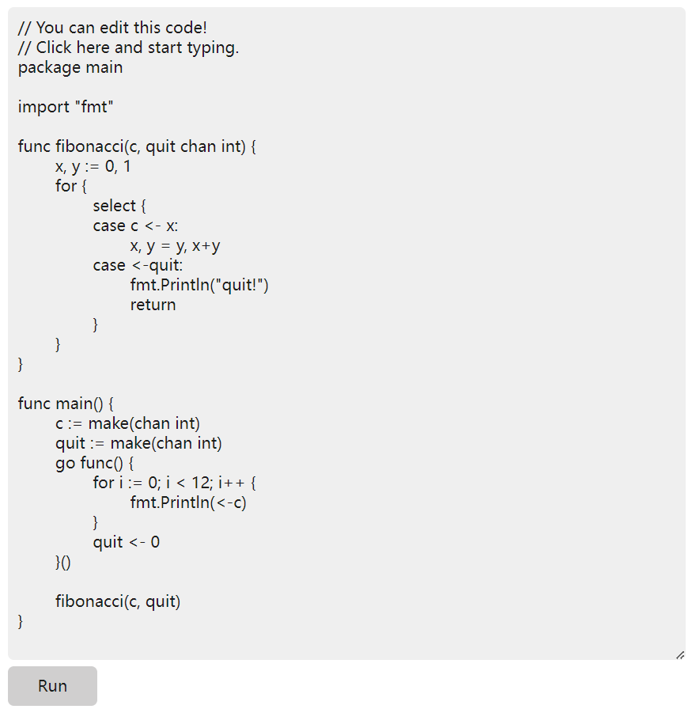

# Goscript：Rust 实现的 Go 语言规范

出品|开源中国

文|局长

Anaconda 开发商最近发布了 PyScript，这是一个可以让开发者在 HTML 中混写 Python 代码的框架，有人将其称为 “Python 版 JSP”。事实上，PyScript 底层采用了 WebAssembly， 因为它基于 Pyodide 构建，Pyodide 由编译成 WebAssembly 的 CPython 3.8 解释器组成，允许在网页浏览器中运行 Python。

无独有偶，开发者采用相同的思路让 Go 也顺利在浏览器上运行。**https://goscript.dev** 网站支持在浏览器端直接运行 Go 代码，这是一个 Go playground，底层采用 Goscript，通过 WASM 实现。

Goscript 是 Go 语言规范的非官方实现，用于 Rust 项目的内嵌或封装，提供了更简单的方式封装和调用底层的 Rust 代码。就像 Lua 之于 Redis/WoW，或者 Python 之于 NumPy。

Goscript 包含六个项目：

- **parser** 把源代码变成 AST，移植自 Go 官方代码。
- **type checker** 基于 AST 做类型推倒和类型检查，也移植自 Go 官方代码。
- **codegen** 基于 AST 和类型信息生成字节码。
- **vm** 运行字节码。
- **std** 官方库，移植自 Go 官方库。
- **engine** 包含官方库的 native 部分，再加上简单封装。

Goscript 实现了 Go 的几乎所有特性（pre 1.18，因此不包括泛型），并移植了部分官方库，已通过的相关测试用例查看 https://github.com/oxfeeefeee/goscript/tree/master/engine/tests。

Goscript 项目代码：https://github.com/oxfeeefeee/goscript
