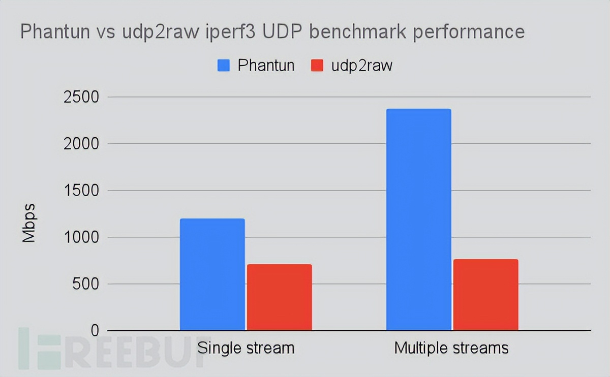
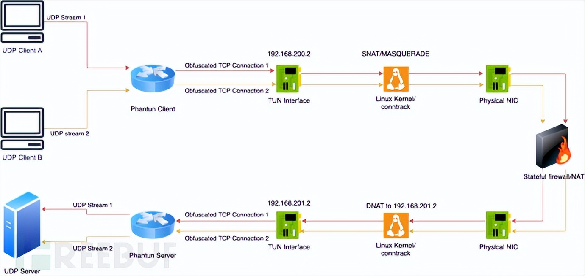

# Phantun：一款功能强大的轻量级UDP转TCP混淆工具 #

## 关于Phantun ##

Phantun是一款功能强大的轻量级UDP转TCP混淆工具，该工具可以将UDP数据包混淆成TCP连接，旨在以最小的处理和封装开销实现最大的性能。该工具通常用于UDP被阻止/限制但TCP被允许通过的环境。

Phantun可以将UDP数据包流转换成经过模糊/混淆处理的TCP数据包流。Phantun使用的TCP堆栈可以通过大多数L3/L4有状态/无状态防火墙/NAT设备，但无法通过L7代理。

Phantun工具采用了纯Rust开发，并且经过了大量的版本迭代和功能优化，可以在多核系统上进行快速扩展，并且消耗资源也非常少。



Phantun：一款功能强大的轻量级UDP转TCP混淆工具

## 工具数据流/架构 ##

Phantun：一款功能强大的轻量级UDP转TCP混淆工具

## 工具下载 ##

广大研究人员可以使用下列命令将该项目源码克隆至本地：

	git clone https://github.com/dndx/phantun.git

## 工具使用 ##

对于下面的示例，做如下假设：

假设Phantun服务器在端口4567（服务器的--local选项）侦听传入的Phantun客户端连接，并在127.0.0.1:1234（服务器的--remote选项）将UDP数据包转发到UDP服务器。

假设Phantun客户端在127.0.0.1:1234（客户端的--local选项）监听传入的UDP数据包，并在10.0.0.1:4567（客户端的--remote选项）连接到Phantun服务器。

Phantun为客户端和服务器创建TUN接口。对于客户端，Phantun默认为自己分配IP地址192.168.200.2；对于服务器，它默认为自己分配IP地址192.168.201.2。

## 使用样例 ##

**1、启用内核IP转发**

编辑“/etc/sysctl.conf”，添加“net.ipv4.ip_forward=1”，然后运行下列命令：

	sudo sysctl -p /etc/sysctl.conf

**2、添加所需防火墙规则**

客户端

使用nftable：

```
table inet nat {

    chain postrouting {

        type nat hook postrouting priority srcnat; policy accept;

        iifname tun0 oif eth0 masquerade

    }

}
```

使用iptable：

	iptables -t nat -A POSTROUTING -o eth0 -j MASQUERADE

服务器端

使用nftable：

```
table ip nat {

    chain prerouting {

        type nat hook prerouting priority dstnat; policy accept;

        iif eth0 tcp dport 4567 dnat to 192.168.201.2

    }

}
```

使用pitable：

	iptables -t nat -A PREROUTING -p tcp -i eth0 --dport 4567 -j DNAT --to-destination 192.168.201.2

**3、运行Phantun代码（非root权限，可选）**

以root用户身份运行面向网络的应用程序是不明智的，因此Phantun 支持以非root用户权限运行，并带有cap_net_admin功能：

	sudo setcap cap_net_admin=+pe phantun_server
	sudo setcap cap_net_admin=+pe phantun_client

**4、开启Phantun守护进程**
提示：使用-h参数运行Phantun后可以查看该工具支持的所有参数选项。

服务器端

注意：4567是Phantun监听的TCP端口，然后对应之前指定的DNAT规则。127.0.0.1:1234则是要连接的UDP服务器：

	RUST_LOG=info /usr/local/bin/phantun_server --local 4567 --remote 127.0.0.1:1234
或者，使用--remote指定主机名称：

	RUST_LOG=info /usr/local/bin/phantun_server --local 4567 --remote example.com:1234

客户端

注意：127.0.0.1:1234是Phantun需要监听的UDP地址和端口。10.0.0.1:4567则是要连接的Phantun服务器 ：

	RUST_LOG=info /usr/local/bin/phantun_client --local 127.0.0.1:1234 --remote 10.0.0.1:4567
或者，使用--remote指定主机名称：

	RUST_LOG=info /usr/local/bin/phantun_client --local 127.0.0.1:1234 --remote example.com:4567

## 许可证协议 ##

本项目的开发与发布遵循Apache2.0开源许可证协议。

## 最新发布版本 ##

Phantun v0.3.2：https://github.com/dndx/phantun/releases/tag/v0.3.2

## 项目地址 ##

Phantun：https://github.com/dndx/phantun

