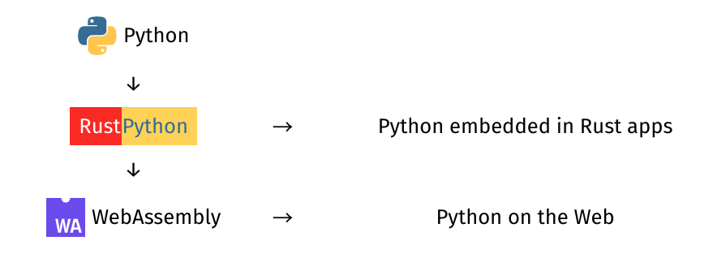

# RustPython 基于 Rust 的 Python 解释器

### 软件简介

RustPython 是一个由 Rust 编写的 Python 3 解释器。RustPython 可以嵌入到 Rust 程序中，使用 Python 作为应用程序的脚本语言，也可以将其编译为 WebAssembly，在浏览器中运行 Python。



### 用法：

RustPython 需要 Rust 1.43.0 或以上版本，可以使用以下命令检查 Rust 的版本：

`rustc --version`

如果想更新至最新版可以使用以下命令：

`rustup update stable`

要在本地构建 RustPython，可执行以下操作：

```
$ git clone https://github.com/RustPython/RustPython
$ cd RustPython

# if you're on windows:

$ powershell scripts\symlinks-to-hardlinks.ps1

# --release is needed (at least on windows) to prevent stack overflow

$ cargo run --release demo.py
Hello, RustPython!` 
```

或使用交互式 shell：

```
$ cargo run --release
Welcome to rustpython

> > > > > 2+2
> > > > > 4`
```

还可以使用以下命令安装和运行 RustPython：

```
$ cargo install rustpython
$ rustpython
Welcome to the magnificent Rust Python interpreter

> > > > > 
```

或通过 `conda` 包管理器：

```
$ conda install rustpython -c conda-forge
$ rustpython
``` 

### WASI：

可以使用以下命令将 RustPython 编译为独立的 WebAssembly WASI 模块，以便可以在任何地方运行它。

```
$ wapm install rustpython
$ wapm run rustpython

> > > > > 2 + 2
> > > > > 4
```

#### 构建 WASI 文件

使用以下方法构建 WebAssembly WASI 文件：

```
cargo build --release --target wasm32-wasi --features="freeze-stdlib"`
```

### 代码

### 


[Gitee 极速下载/RustPython](https://gitee.com/mirrors/RustPython)

[Star 8](https://gitee.com/mirrors/RustPython) | [Fork 1](https://gitee.com/mirrors/RustPython)

RustPython 是一个由 Rust 编写的 Python 3 解释器

**[最近提交:](https://gitee.com/mirrors/RustPython/commits/master)**

- [5b5abe25](https://gitee.com/mirrors/RustPython/commit/5b5abe25d9adc542faaeb28e92561b8e8f161865)   [Merge pull request #4269 from afonso360/jit-more-ops](https://gitee.com/mirrors/RustPython/commit/5b5abe25d9adc542faaeb28e92561b8e8f161865)
  
  [Jeong YunWon](mailto:69878%2Byouknowone@users.noreply.github.com) 2022-11-08 21:53

- [27bf82a2](https://gitee.com/mirrors/RustPython/commit/27bf82a2251d7e6ac6cd75e6ad51be12a53d84bb)   [Merge pull request #4266 from charliermarsh/charlie/comments](https://gitee.com/mirrors/RustPython/commit/27bf82a2251d7e6ac6cd75e6ad51be12a53d84bb)
  
  [Jim Fasarakis-Hilliard](mailto:d.f.hilliard@gmail.com) 2022-11-07 23:20

- [bbe7c1f3](https://gitee.com/mirrors/RustPython/commit/bbe7c1f35b8bfdb4eb8c3070f47b0fe67100f645)   [Merge pull request #4261 from charliermarsh/charlie/compa...](https://gitee.com/mirrors/RustPython/commit/bbe7c1f35b8bfdb4eb8c3070f47b0fe67100f645)
  
  [Jim Fasarakis-Hilliard](mailto:d.f.hilliard@gmail.com) 2022-11-07 21:04

[main 分支：](https://gitee.com/mirrors/RustPython) 2022-11-08

[源码下载](https://gitee.com/mirrors/RustPython)
