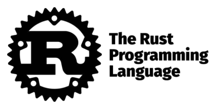
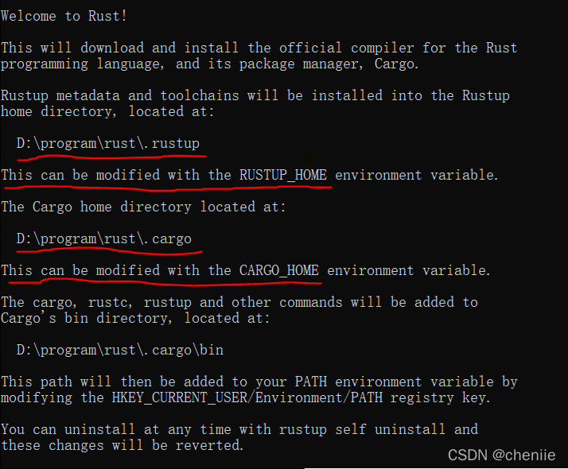
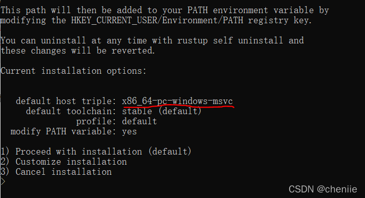
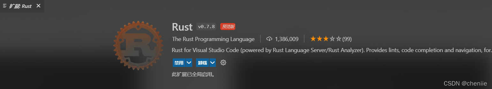

# Rust安装(windows) #

cheniie

于 2021-12-17 22:04:43 发布

1388
 收藏 3
分类专栏： Rust 文章标签： rust windows 开发语言
版权

Rust
专栏收录该内容
1 篇文章0 订阅
订阅专栏



## windows安装Rust开发环境指南 ##

Rust的安装非常简单，官网下载安装包双击就能安装，但是在windows上使用总是能遇到一些问题，今天我们就来踩踩坑。

## 设置安装路径 ##

当你安装Rust的时候会发现没法选安装路径，对于强迫症来说，还没开始就劝退了。其实Rust是可以执行安装路径的，只不过需要通过环境变量来指定。首先说怎么操作，后面再看为什么。

Rust需要安装两个东西，一个是rustup，一个是cargo。所以你需要设置两个环境变量来分别指定他们的安装目录。

通过RUST_HOME指定rustup的安装目录。
通过CARGO_HOME指定cargo的按钻过目录。

这两个环境变量既可以放在用户环境变量下，也可以放在系统环境变量下。

当我们打开Rust安装程序，选择y继续安装时，可以先把鼠标网上滚一滚，看看Rust都打印了什么信息。



注意看划红线的地方，如果你没设置过环境变量，那么默认会安装到C:\User\用户名\.rust下。

## 没有C++环境 ##

Rust编译需要C++环境，如果你没有，Rust也能安装成功，只是无法编译代码。下面我们分几种情况来谈论。

## 已经安装了Rust ##

如果你已经在没有C++环境的情况下安装了Rust，此时你可以选择去安装visual studio code，然后就能使用Rust了。但是如果你不想安装这么个大家伙，而且你本身也不是做C/C++开发的，那么你可以使用下面的命令挽救。

	rustup toolchain install stable-x86_64-pc-windows-gnu 
	rustup default stable-x86_64-pc-windows-gnu


然后在你的rustup的安装目录的toolchain目录下会出现stable-x86_64-pc-windows-gnu这样一个目录，它下面有个bin目录，你需要确认下这个bin目录已经添加到path。然后就能使用Rust编译了。

关于第二个命令我们稍微解释下。C++的编译工具有两个，一个是msvc，也就是visual studio code会安装的，另一个是mingw。在没有安装visual studio code单数又需要C++环境时，我们会首选安装mingw。上面的第二行命令其实就是把Rust用到的C++工具设置为mingw。因为它默认选择的是x86_64-pc-windows-msvc。



如果你之前已经安装过mingw，但是安装Rust选的是默认的x86_64-pc-windows-msvc。那么其实你只需要执行上面的第二条命令就可以了，但是要注意你的mingw要加到path。

## 还没安装Rust ##

如果你还没有安装Rust，那么可以在输入y以后选择2，进入自定义安装。然后在需要输入host triple的时候输入x86_64-pc-windows-gnu，后面都默认。当再次回到上图的界面是，你会发现default host triple那一行已经变成了x86_64-pc-windows-gnu，此时再选择1进行安装。

安装完成后执行下rustup toolchain install stable，装完收工。

要验证Rust安装成功可以执行下rustup --version。
要更新Rust可以执行rustup update。
卸载请执行rustup self uninstall。
关于rustup命令更多内容，可以看rustup官方文档。

## IDE ##

Rust并没有专用的IDE，推荐使用vscode，安装下Rust插件，有只能提示和文档，还是蛮爽的。



另外你用vscode打开.rs文件时会提示你安装Rust扩展，直接点安装就完了，装完就可以爽了。再奉送一个vscode小技巧，如果你习惯用命令行的话，输入code .就能打开vscode并且已打开当前目录。

不知道有没有人好奇我的vscode的毛玻璃效果，它是Vibrancy这个插件，不过只能用于vscode默认的黑色主题。

最后再奉上一个例子，是力扣题库的第一题：两数之和。需要一点基础，刷题其实也是快速熟悉一门语言语法比较好的方式。

```
use std::collections::HashMap;

fn main() {
    let res = tow_sum(vec![3,2,4], 6);
    println!("{:?}", res);
}

fn tow_sum(nums:Vec<i32>, target: i32) -> Vec<i32> {
    let mut map = HashMap::new();
    for (i,v) in nums.iter().enumerate() {
        let rem = target - v;
        if let Some(j) = map.get(&rem) {
            return vec![i as i32,*j];
        }
        map.insert(v, i as i32);
    }
    vec![]
}
```

————————————————

版权声明：本文为CSDN博主「cheniie」的原创文章，遵循CC 4.0 BY-SA版权协议，转载请附上原文出处链接及本声明。

原文链接：https://blog.csdn.net/puss0/article/details/122004584
