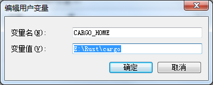
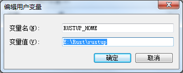
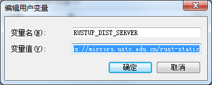
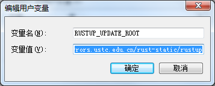
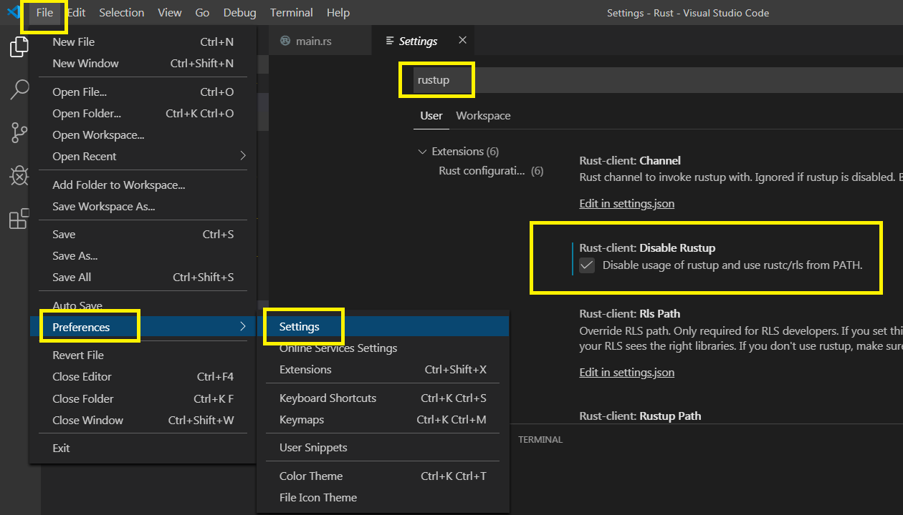
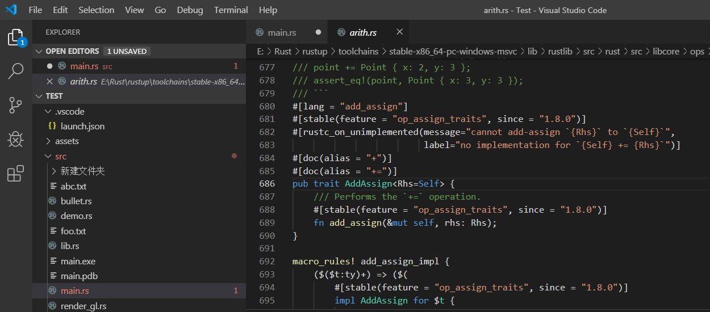

# Win7 VSCode 在线安装Rust语言及环境配置 #

睡前彻底解决在VSCode中，按F12不跳转到标准库源码的问题。

 

首先，如果装过离线版，卸载掉。

然后去官网下载

    rustup-init.exe
    
    https://www.rust-lang.org/tools/install

下好后别急着安装

新建4个环境变量

    CARGO_HOME
    E:\Rust\cargo
    
     
    
    RUSTUP_HOME
    E:\Rust\rustup
    
     
    
    RUSTUP_DIST_SERVER
    https://mirrors.ustc.edu.cn/rust-static
    
     
    
    RUSTUP_UPDATE_ROOT
    https://mirrors.ustc.edu.cn/rust-static/rustup

 

前两个是你要自定义的cargo和rustup目录，后两个是切换rustup为国内源，不然只能挂代理。

搞定后双击rustup-init.exe，按1默认安装，也就是安装msvc版本。

慢长等待后，应该会显示安装成功。

 

接下来和之前一样，进入自定义的cargo目录，新建没有扩展名的config文件，内容同上一篇博客，也是切换为国内下载源。

    [source.crates-io]
    registry = "https://github.com/rust-lang/crates.io-index"
    replace-with = 'ustc'
    [source.ustc]
    registry = "https://mirrors.ustc.edu.cn/crates.io-index"
 

打开一个命令提示符，输入

    rustup component add rust-src

如果显示

    info: component 'rust-src' is up to date

说明源码已经安装

现在打开VSCode

如果之前在VSCode中禁用过rustup，现在把勾去掉，再启用

 

测试下F12，找个地方写入

    std::ops::AddAssign

按F12看能不能跳转，如果找不到，等一会儿再试应该就能跳转了，显示找不到时，可以自己手动打开路径看一下文件是否存在，类似

    E:\Rust\rustup\toolchains\stable-x86_64-pc-windows-msvc\lib\rustlib\src\rust\src\libcore\ops\arith.rs

然后再回VSCode中按F12就会直接跳到源码处了。

这个有时显示找不到似乎是一个Bug，但是我这里目前能正确跳转到源码了。

 

参考链接：

https://blog.csdn.net/m0_37696990/article/details/82812628

https://fungos.github.io/blog/2017/08/12/setting-up-a-rust-environment-on-windows/