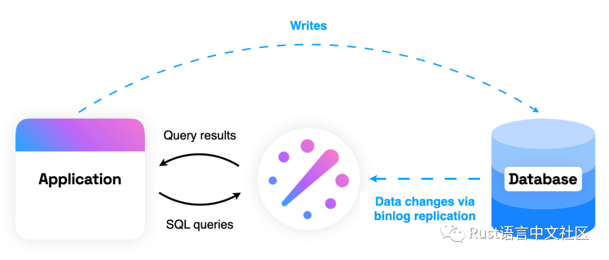

# 【Rust 日报】2022-06-19 Rust 1.63 新特性令人期待 #

**Rust 1.63新特性**

Rust 标准库 1.63 增加了一个期待已久的功能：scoped thread（作用域线程）。与 thread::spawn() 不同，这个新特性允许线程借用局部变量，而不仅仅是静态变量。借用官方例子：

```
use std::thread;
let mut a = vec![1, 2, 3];
let mut x = 0;
 
thread::scope(|s| {
    s.spawn(|| {
        println!("hello from the first scoped thread");        // borrow `a` here
        dbg!(&a);
    });
    s.spawn(|| {
        println!("hello from the second scoped thread");        // mutably borrow `x`, because no other threads are using it
        x += a[0] + a[2];
    });
    println!("hello from the main thread");
});// after the scope, can modify and access the variables againa.push(4);assert_eq!(x, a.len());
```

更多可查看官方文档：https://doc.rust-lang.org/nightly/std/thread/fn.scope.html

另外，Mutex::new，RwLock::new 和 Condvar::new 都是 const function。这意味着现在可以将这些类型用作静态变量，而不再需要 lazy_static 或 once_cell 或其他解决方法。

Rust 1.63 将会在 8 月 11 日发布。

**readyset：一个轻量SQL缓存引擎**

ReadySet 是一个轻量级的 SQL 缓存引擎，可预先计算经常访问的查询结果，并在数据库中的基础数据更改时自动使这些结果随时间推移保持最新。ReadySet 与 MySQL 和 Postgres 有线兼容，无需更改代码即可采用。ReadySet 同时充当 SQL 缓存和代理 – 当首次将 ReadySet 连接到应用程序时，它默认将所有查询代理到后面的数据库，因此它不会更改应用程序的行为。



主页：https://readyset.io/

文档：https://docs.readyset.io/

GitHub：https://github.com/readysettech/readyset

**ante：一个安全简单的系统语言**

Ante 是一种低级别的函数式语言，用于探索细化类型、生命周期推理和其他有趣的功能。

```
type Person = name: string, job: ref string// Infer that the data referenced via `&` should not be freed inside this functionmake_person name =
    Person name &"programmer"// bob is only used at this scope, so it can be safely freed afterwardbob = make_person "bob"// unlike ownership systems, aliasing is allowed with lifetime inferencebob_twin = bob
assert (bob.name == bob_twin.name)
```

语言概览：https://antelang.org/docs/language/

主页：http://antelang.org/

GitHub：https://github.com/jfecher/ante

**quartz.rs：一个小巧的调度库**

简单示例：

```
use std::{thread, time::Duration};
struct MyTask;
impl quartz_sched::Job for Box<MyTask> {
    fn execute(&self) {
        println!("[+] Executing 'MyTask'");
    }
    fn description(&self) -> String {
        "my task".to_string()
    }
    fn key(&self) -> i64 {
        43
    }
}

fn main() {
    let mut sched: quartz_sched::Scheduler = quartz_sched::Scheduler::new();    // start the scheduler
    // spawns execution and feeder threads
    sched.start();    // execute after duration N
    sched.schedule_task(
	quartz_sched::schedule_task_after(
        Duration::from_secs(1),        Box::new(MyTask),
    ));
    // get scheduled job meta info from scheduler
    match sched.get_scheduled_job(/*key*/ 43) {
        Some(job) => {
            println!("[+] Next run at tick: {}", &job.next_runtime);
        }
        None => {}
    };
 
    thread::sleep(Duration::from_secs(20));    // scheduler will stop after getting dropped
    // alternatively, call sched.stop() to stop
    // the scheduler.
 
    // delete task associated with key from scheduler
    _ = sched.delete_task(43);
}
```

GitHub：https://github.com/mitghi/quartz.rs


————————————————

版权声明：本文为CSDN博主「Rust语言中文社区」的原创文章，遵循CC 4.0 BY-SA版权协议，转载请附上原文出处链接及本声明。

原文链接：https://blog.csdn.net/u012067469/article/details/125364813