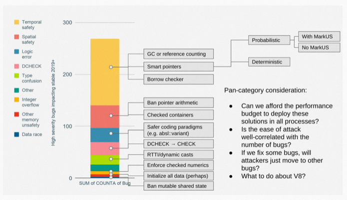

# 一名C++程序员的Rust入门初体验

## 背景

S2在推进团队代码规范时，先后学习了盘古编程规范，CPP core guidelines，进而了解到clang-tidy，以及Google Chrome 在安全方面的探索。

C++是一个威力非常强大的语言，但是能力越大，责任越大，它的内存安全性问题一直饱受诟病。NSA甚至明确提出，停止使用C++这种内存不安全的语言。

C++本身的确提出了一系列改进方案，但是迟迟不见落地。Bjarne对于NSA挑战给出的方案也只能部分解决问题，并且看起来落地也是遥遥无期。

Rust作为一个新晋语言，是Mozilla应对内存安全性问题发明的新语言（之前它也是使用C++的），Linux和Chrome都开始先后接纳了它，Tikv与大部分区块链项目，在第一天就选择了它。

遇到若干次内存踩坏问题后，我有了了解Rust的冲动。

## C++代码中的风险



这张图是Chrome团队发布的Chrome的代码被攻击的Bug类型的分布，可以看到，内存安全性占了一半以上。

- Temporal safety: 简单来说就是use after free
- Spatial safety: 简单来说，就是out of bound访问
- Logic error
- DCHECK: 简单来说，就是debug assert的条件在release版本中被触发了

其他不多展开。

## Rust初体验

初体验Rust，实际上更多的是感觉到它的一些小设计非常甜，它会让我们的编程很舒服。

简单来说，所有C++通过Best Practice/Effective C++/...等推行的写法，Rust全部是编译器强制的。

**默认不可变**

Rust中，所有变量是默认不可变的，可变需要额外的typing。这与C++是完全相反的。然而，这与C++ Core Guidelines中的推荐却是一致的。

```
let x = 0;
x = 10;  // error

let mut y = 0;
y = 10;  //ok
```

**禁止整数隐式转换**

```
fn foo(x: u32) {}

let x: i32 = 0;
foo(x);  // error
```

Be explicit，这条软件界的普遍规则，在C/C++中却是完全不适用，真是反直觉。

**简化构造、复制与析构**

C++中的Rule of 3 or 5 or 6可谓是大名鼎鼎，我们无数次需要写以下代码

```
class ABC
{
public:
    virtual ~ABC();

    ABC(const ABC&) = delete;
    ABC(ABC&&) = delete;

    ABC& operator=(const ABC&) = delete;
    ABC& operator=(ABC&&) = delete;
};
```

明明是一件非常常规的东西，写起来却那么的复杂。

Rust非常简单，所以对象默认只支持Destructive move（通过memcpy完成）。需要复制，要类显式实现Clone trait，复制时写.clone(), 对于trivial对象，期望能通过=来隐式copy，要显式实现Copy，实现Copy时，不允许类再实现Drop（即析构函数）。

```
fn main()
{
    // String类似std::string，只支持显式clone，不支持隐式copy
    let s: String = "str".to_string();
    
    foo(s);  // s will move
    // cannot use s anymore

    let y = "str".to_string();
    foo(y.clone());

    // use y is okay here
}

fn foo(s: String) {}

// can only be passed by move
struct Abc1
{
    elems: Vec<int>
}

// can use abc.clone() to explicit clone a new Abc
#[derive(Clone)]
struct Abc2
{
    elems: Vec<int>
}

// implement custom destructor for Abc
impl Drop for Abc2 {
    // ...
}

// foo(xyz) will copy, 不能再定义Drop/析构函数，因为copy和drop是互斥的
#[dervie(Clone, Copy)]
struct Xyz
{
    elems: i32
}
```

比起C++的move，以及其引入的use after move问题，还有各种Best Practice，Rust的做法实在是高明了不少。

妈妈再也不用担心我会不小心copy一个有1千万元素的vector了。review时也再也不用纠结，这里到底是用值还是const&了。

**显式参数传递**

C++中函数参数传递的Best Practice能写一堆，in/out/inout参数如何处理也没有一个明确的规范。Rust则简化了参数传递，并且将一切由隐式转变为显式。

```
let mut x = 10;

foo(x);  // pass by move, x cannot be used after the call
foo(&x);  // pass by immutable reference
foo(&mut x); // pass by mutable reference
```

**统一的错误处理**

错误处理一直是C++中一个非常分裂的地方，截止C++23，目前C++标准库中，有以下用于错误处理的功能：

- errno
- std::exception
- std::error_code/std::error_condition
- std::expected

看，连标准库自己都这样。std::filesystem，所有接口都有至少两个重载，一个抛异常，一直传std::error_code。

Rust的方案与Herb提出的static异常类似，并且通过语法糖，让错误处理非常容易。

```
enum MyError
{
    NotFound,
    DataCorrupt,
    Forbidden,
    Io(std::io::Error)
}

impl From<io::Error> for MyError {
    fn from(e: io::Error) -> MyError {
        MyError::Io(e)
    }
}

pub type Result<T> = result::Result<T, Error>;

fn main() -> Result<()>
{
    let x: i32 = foo()?;
    let y: i32 = bar(x)?;

    foo();  // result is not handled, compile error

     // use x and y
}

fn foo() -> Result<i32>
{
    if (rand() > 0) {
        Ok(1)
    } else {
        Err(MyError::Forbidden)
    }
}
```

错误处理一律通过Result<T, ErrorType>来完成，通过?，一键向上传播错误（如同时支持自动从ErrorType1向ErrorType2转换，前提是你实现了相关trait），没有错误时，自动解包。当忘记处理处理Result时，编译器会报错。

**内置格式化与lint**

Rust的构建工具cargo，内置了cargo fmt和cargo clippy，一键格式化与lint，再也不用人工配置clang-format和clang-tidy了。

**标准化的开发流程和包管理**

Rust最为C++程序员所羡慕的地方是，它有官方包管理工具cargo。C++非官方包管理工具conan目前有1472个包，cargo的包管理平台有106672个包。

cargo还原生支持了test与benchmark，一键运行

```
cargo test
cargo bench
```

cargo规定了目录风格

```
benches  // benchmark代码go here
src
tests  // ut go here
```

## Rust在安全性的改进

上一节提的其实还是非致命的东西，Rust在内存安全方面的改进，才是让它与众不同的原因。

**lifetime安全性**

use-after-free是这个世界上最为著名的bug之一。解决它的方案一直以来都是依赖运行时检查，两个主要流派是GC与引用计数。而Rust在此之外引入了一种新的机制：Borrow Check。

Rust规定，所有对象都是有所有权的，赋值意味着所有权的转让。一旦所有权转让后，旧的对象将无法再被使用(destructive move)。Rust允许一个对象的所有权暂时被租用给其他引用。所有权可以租借给若干个不可变引用，或者一个独占的可变引用。

举个例子：

```
let s = vec![1,2,3];  // s owns the Vec
foo(s);  // the ownership is passed to foo, s cannot be used anymore

let x = vec![1,2,3];
let a1 = &x[0];
let a2 = &x[0];  // a1/a2 are both immutable ref to x

x.resize(10, 0);  // error: x is already borrowed by a1 and a2

println!("{a1} {a2}");
```

这种unique ownership + borrow check的机制，能够有效的避免pointer/iterator invalidation bug以及aliasing所引发的性能问题。

在此之上，Rust引入了lifetime概念，即，每个变量有个lifetime，当多个变量间存在引用关系时，编译器会检查这些变量之间的lifetime关系，禁止一个非owning引用，在其原始对象lifetime结束之后再被访问。

```
let s: &String;

{
    let x = String::new("abc");
    s = &x;
}

println!("s is {}", s);  // error, lifetime(s) > lifetime(x)
```

这个例子比较简单，再看一些复杂的。

```
// not valid rust, for exposition only
struct ABC
{
    x: &String,
}

fn foo(x: String)
{
    let z = ABC { x: &x };

    consume_string(x);  // not compile, x is borrowed by z
    drop(z);  // call destructor explicitly

    consume_string(x);  // ok

    // won't compile, bind a temp to z.x
    let z = ABC { x: &String::new("abc") };
    // use z

    // Box::new == make_unique
    // won't compile, the box object is destroyed soon
    let z = ABC{ x: &*Box::new(String::new("abc") };
    // use z
}
```


再看一个更加复杂的，涉及到多线程的。

```
void foo(ThreadPool* thread_pool)
{
    Latch latch{2};

    thread_pool->spawn([&latch] {
        // ...
        latch.wait();  // dangle pointer访问
    });

    // forget latch.wait();
}
```


这是一个非常典型的lifetime错误，C++可能要到运行时才会发现问题，但是对于Rust，类似代码的编译是不通过的。因为latch是个栈变量，其lifetime非常短，而跨线程传递引用时，这个引用实际上会可能在任意时间被调用，其lifetime是整个进程生命周期，rust中为此lifetime起了一个专门的名字，叫'static。正如cpp core guidelines所说：CP.24: Think of a thread as a global container ，never save a pointer in a global container。

在Rust中，rust编译器会强制你使用引用计数，来显示说明共享需求（em...发现这句话问题的，已经是Rust高手了）。

```
fn foo(thread_pool: &mut ThreadPool)
{
    let latch = Arc::new(Latch::new(2));
    let latch_copy = Arc::clone(&latch);

    thread_pool.spawn(move || {
        // the ownership of latch_copy is moved in
        latch_copy.wait();
    });

    latch.wait();
}
```


再看一个具体一些例子，假设你在写一个文件reader，每次返回一行。为了降低开销，我们期望返回的这一行，直接引用parser内部所维护的buffer，从而避免copy。

```
FileLineReader reader(path);

std::string_view<char> line = reader.NextLine();
std::string_view<char> line2 = reader.NextLine();

// ops
std::cout << line;
```

再看看Rust

```
let reader = FileReader::next(path);
let line = reader.next_line();

// won't compile, reader is borrowed to line, cannot mutate it now
let line2 = reader.next_line();

println!("{line}");
```


```
// &[u8] is std::span<byte>
fn foo() -> &[u8] {
    let reader = FileReader::next(path);
    let line = reader.next_line();

    // won't compile, lifetime(line) > lifetime(reader)
    return line;
}
```

总结来说，Rust定义了一套规则，按照此规则进行编码，绝对不会有lifetime的问题。当Rust编译器无法推导某个写法的正确性时，它会强制你使用引用计数来解决问题。

**边界安全性**

Buffer overflow以及out of bound访问也是一类非常重要的问题，这类问题相对好解，给标准库实现加下bound check就好了。Rust标准库会进行bound check。

这方面，C++稍微努力下，还是能避免的。

啥？bound check性能差。Em...看看Chrome发布的漏洞报告吧，人呢，还是不要太自信得好。毕竟，Bjarne都开始妥协了。Herb的slide中有对out of bound问题一些数字的说明。

**类型安全性**

Rust默认强制变量初始化，并且禁止隐式类型转换。

```
let i: i32;

if rand() < 10 {
    i = 10;
}

println!("i is {}", i);  // do not compile: i is not always initialized
```

## Rust的多线程安全性

如果说lifetime + ownership模型是Rust的安全核心的话，Rust的多线程安全性就是在此基础上结出的果实。Rust的多线程安全性，完全是通过库机制来实现的。

首先介绍两个基础概念：

- Send: 一个类型是Send，表明，此类型的对象的所有权，可以跨线程传递。当一个新类型的所有成员都是Send时，这个类型也是Send的。几乎所有内置类型和标准库类型都是Send的，Rc（类似local shared_ptr）除外，因为内部用的是普通int来计数。
- Sync: 一个类型是Sync，表明，此类型允许多个线程共享（Rust中，共享一定意味着不可变引用，即通过其不可变引用进行并发访问）。

Send/Sync是两个标准库的Trait，标准库在定义它们时，为已有类型提供了对应实现或者禁止了对应实现。

通过Send/Sync与ownership模型，Rust让Data race完全无法出现。

简单来说：

- lifetime机制要求：一个对象要跨线程传递时，必须使用Arc（Arc for atomic reference counted）来封装（Rc不行，因为它被特别标注为了!Send，即不可跨线程传递）
- ownership+borrow机制要求：Rc/Arc包装的对象，只允许解引用为不可变引用，而多线程访问一个不可变对象，是天生保证安全的。
- 内部可变性用于解决共享写问题：Rust默认情况下，共享一定意味着不可变，只有独占，才允许变。如果同时需要共享和可变，需要使用额外的机制，Rust官方称之为内部可变性，实际上叫共享可变性可能更容易理解，它是一种提供安全变更共享对象的机制。如果需要多线程去变更同一个共享对象，必须使用额外的同步原语（RefCell/Mutex/RwLock），来获得内部/共享可变性，这些原语会保证只有一个写者。RefCell是与Rc一起使用的，用于单线程环境下的共享访问。RefCell被特别标注为了!Sync，意味着，如果它和Arc一起使用，Arc就不是Send了，从而Arc<RefCell<T>>无法跨线程。

看个例子：假设我实现了一个Counter对象，希望多个线程同时使用。为了解决所有权问题，需要使用Arc<Counter>，来传递此共享对象。但是，以下代码是编译不通过的。

```
struct Counter
{
    counter: i32
}

fn main()
{
    let counter = Arc::new(Counter{counter: 0});
    let c = Arc::clone(&counter);
    thread::spawn(move || {
        c.counter += 1;
    });

    c.counter += 1;
}
```

因为，Arc会共享一个对象，为了保证borrow机制，访问Arc内部对象时，都只能获得不可变引用（borrow机制规定，要么一个可变引用，要么若干个不可变引用）。Arc的这条规则防止了data race的出现。

为了解决这个问题，Rust引入了内部可变性这个概念。简单来说，就是一个wrapper，wrapper可以获得一个内部对象的可变引用，但是wrapper会进行borrow check，保证只有一个可变引用，或者若干个不可变引用。

单线程下，这个wrapper是RefCell，多线程下，是Mutex/RwLock等。当然，如果你尝试写这样的代码，也是编译不通过的

```
fn main()
{
    let counter = Arc::new(RefCell::new(Counter{counter: 0}));
    let c = Arc::clone(&counter);
    thread::spawn(move || {
        c.get_mut().counter += 1;
    });

    c.get_mut().counter += 1;
}
```

为啥？因为RefCell不是Sync，即不允许多线程访问。Arc只在内部类型为Sync时，才为Send。即，Arc<Cell<T>>不是Send，无法跨线程传递。

Mutex是Send的，因此，可以这么写:

```
struct Counter
{
    counter: i32
}

fn main()
{
    let counter = Arc::new(Mutex::new(Counter{counter: 0}));
    let c = Arc::clone(&counter);
    thread::spawn(move || {
        let mut x = c.lock().unwrap();

        x.counter += 1;
    });
}
```

## Rust的性能

作为C++的挑战者，更多的人会关注Rust的性能到底怎么样。Rust的官方哲学是zero cost principle，是不是和C++的zero overhead原则很像。当然，这个名字起的实际上没有C++好，毕竟，做事情就是有cost的，怎么可能是zero cost呢。

Rust添加了bound check，可能会比C++弱一点点，但也有限。同时Rust支持unsafe模式，完全跳过bound check。这让Rust的上限可以和C++持平。

另外，Rust禁止了很多conditionally正确的用法，也会有一定性能损失，比如跨线程必须shared_ptr（额外的动态分配）。

```
// for demo purpose

fn foo(tasks: Vec<Task>)
{
    let latch = Arc::new(Latch::new(tasks.len() + 1));

    for task in tasks {
        let latch = Arc::clone(&latch);
        thread_pool.submit(move || {
            task.run();
            latch.wait();
        });
    }

    latch.wait();
}
```


这里，latch必须用Arc(即shared_ptr)。

在某些场景下，Rust会比C++还快。优化圣经有言，阻碍编译器优化的两大天敌:

- 函数调用
- 指针别名

C++和Rust都可以通过inline来消除函数调用引起的开销。但是C++面对指针别名时，基本上是无能为力的。C++对于指针别名的优化依赖strict aliasing rule，不过这个rule出了名的恶心，Linus也骂过几次。Linux代码中，会使用-fno-strict-aliasing来禁止这条规则的。

不过，C好歹有__restricted__来救救命，C++程序员就只有god knows了。

而Rust通过所有权和借用机制，是能保证没有aliasing现象的。考虑下面这段代码

```
int foo(const int* x, int* y)
{
    *y = *x + 1;

     return *x;
}
```

rust版本

```
fn foo(x: &i32, y: &mut i32) -> i32
{
    *y = *x + 1;

    *x
}
```


对应的汇编如下:

```
# c++
__Z3fooPKiPi:
    ldr    w8, [x0]
    add    w8, w8, #1
    str    w8, [x1]
    ldr    w0, [x0]
    ret

# rust
__ZN2rs3foo17h5a23c46033085ca0E:
    ldr    w0, [x0]
    add    w8, w0, #1
    str    w8, [x1]
    ret
```

看出差别没？

## 感想

最近尝试写了一些Rust代码，发觉体验真的不错。按照Rust社区的说法，使用Rust后，可以无畏地编程，再也不用担心内存错误与Data Race。

然而，对于大量使用C++实现的产品来说，C++是负债，更是资产。已经存在的C++生态很难向Rust进行迁移，Chrome也只是允许在三方库中使用Rust代码。

网上对于Rust与C++的争论也是十分激烈。从我的角度来说，

- C++的安全性演进是趋势，但是未来很不明朗：C++在全世界有数十亿行的存量代码，期望C++在维持兼容性的基础上，提升内存安全性，这是一个几乎不可能的任务。clang-format与clang-tidy，都提供了line-filter，来对特定的行进行检查，避免出现改动一个老文件，需要把整个文件都重新format或者修改掉所有lint失败的情况。大概也是基于此，Bjarne才会一直尝试通过静态分析+局部检查来提升C++的内存安全性。
- Rust有利于大团队协作：Rust代码只要能编译通过，并且没有使用unsafe特性，那么是能够保证绝对不会有内存安全性或者线程安全性问题的。这大大降低了编写复杂代码的心智负担。然而，Rust的安全性是以牺牲语言表达力而获得的，这对于团队合作与代码可读性，可能是一件好事。至于其他，在没有足够的Rust实践经验前，我也无法作出更进一步的判断。

Relax and enjoy coding！

# **参考资料：**

1、Cpp core guidelines: https://isocpp.github.io/CppCoreGuidelines/CppCoreGuidelines

2、Chrome在安全方面的探索：https://docs.google.com/document/d/e/2PACX-1vRZr-HJcYmf2Y76DhewaiJOhRNpjGHCxliAQTBhFxzv1QTae9o8mhBmDl32CRIuaWZLt5kVeH9e9jXv/pub

3、NSA对C++的批评：https://www.theregister.com/2022/11/11/nsa_urges_orgs_to_use/

4、C++ Lifetime Profile: https://isocpp.github.io/CppCoreGuidelines/CppCoreGuidelines#SS-lifetime

5、C++ Safety Profile: https://open-std.org/JTC1/SC22/WG21/docs/papers/2023/p2816r0.pdf?file=p2816r0.pdf

6、Herb CppCon2022 Slide: https://github.com/CppCon/CppCon2022/blob/main/Presentations/CppCon-2022-Sutter.pdf

7、Rust所有权模型理解：https://limpet.net/mbrubeck/2019/02/07/rust-a-unique-perspective.html

8、Rust无畏地并发编程：https://blog.rust-lang.org/2015/04/10/Fearless-Concurrency.html